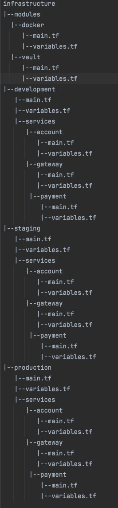

# Form3 Platform Interview Solution

## Proposed Structure

### Separate configurations per environment  
Even though this might have some code duplication, which can be minimized by using modules, separating configurations for each environment would yield below benefits:    
- Ability to scale our environments separately.
- Maintain a separate `terraform state` for each environment, providing complete separation and control over our environments, which can be managed either via `workspaces` or via `terraform init`, ran in each environment
- Ability to selectively import modules for each environment.  

### Modules per provider
I have also decided to break down the `monolity main.tf` into modules of `Vault and Docker`. This gives us the ability to:
- Easily maintain our modular codebase 
- Group similar modules together based on rate of change, scope, maintenance, etc
- Load specific modules per service and environment

### CI/CD consideration
With the above proposed approach, one could have separate stages per environment in a pipeline and can run higher stages only when the lower stages pass.  
This has been demonstrated in the `Vagrant` file which runs the below steps in sequence:  
`pushd /vagrant/tf/development`  
`terraform init -upgrade`  
`terraform apply -auto-approve`  
`popd`  
`pushd /vagrant/tf/staging`  
`terraform init -upgrade`  
`terraform apply -auto-approve`  
`popd`  
`pushd /vagrant/tf/production`  
`terraform init -upgrade`  
`terraform apply -auto-approve`  
`popd`  

  
[Thank you for giving me the opportunity. `Being a beginner to terraform`, I enjoyed this assignment thoroughly and learnt quite a lot about infrastructure as code] 